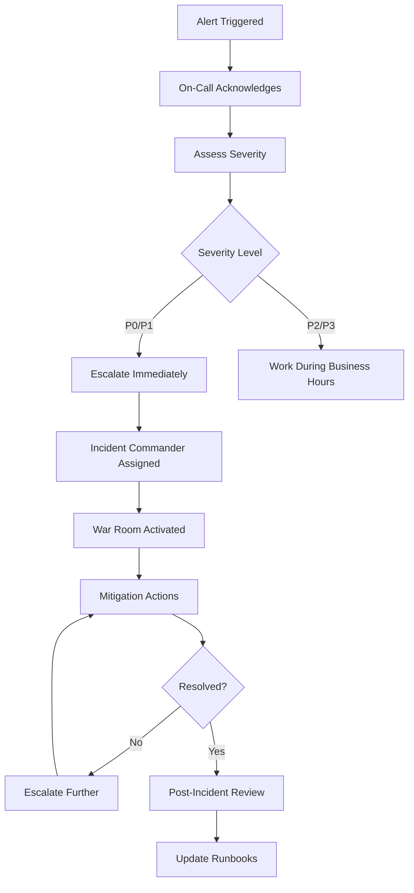

# 🔄 Day 2: Operations & Optimization

## Overview

Day 2 is **continuous operations**—the ongoing work of running, monitoring, optimizing, and improving your Kubernetes platform. This is where operational excellence is built.

**Timeline**: Ongoing (months to years)

---

## 🎯 Objectives

- Maintain high availability and performance
- Continuously optimize costs
- Enhance security posture
- Automate operational tasks
- Build institutional knowledge
- Improve developer experience

---

## 📁 What's in This Directory

### 1. Runbooks (`./runbooks/`)

Step-by-step operational procedures:
- Incident response
- Common troubleshooting
- Upgrade procedures
- Scaling operations

### 2. Automation (`./automation/`)

Operational automation:
- Self-healing systems
- Auto-scaling tuning
- Automated remediation
- Backup automation

### 3. Optimization (`./optimization/`)

Performance and cost optimization:
- Resource right-sizing
- Cost reduction strategies
- Performance tuning
- Capacity planning

### 4. Chaos Engineering (`./chaos-engineering/`)

Resilience testing:
- LitmusChaos experiments
- Fault injection scenarios
- Resilience validation

### 5. Upgrades (`./upgrades/`)

Safe upgrade procedures:
- Kubernetes version upgrades
- Application upgrades
- Platform component upgrades

### 6. Troubleshooting (`./troubleshooting/`)

Common issues and solutions:
- Debugging guides
- Log analysis
- Performance profiling

---

## 🔄 Day 2 Operational Rhythm

### Daily

- [ ] Review overnight alerts
- [ ] Check cluster health metrics
- [ ] Monitor cost trends
- [ ] Review security scan results
- [ ] Address critical incidents

### Weekly

- [ ] Capacity planning review
- [ ] Security vulnerability remediation
- [ ] Performance optimization
- [ ] Cost optimization analysis
- [ ] Runbook updates

### Monthly

- [ ] DR testing
- [ ] Chaos engineering experiments
- [ ] Cost review with finance
- [ ] Security audit
- [ ] Platform roadmap review

### Quarterly

- [ ] Kubernetes version upgrade
- [ ] Architecture review
- [ ] Tool evaluation
- [ ] Team training
- [ ] Incident retrospectives

---

## 📊 Key Performance Indicators (KPIs)

### Reliability

| Metric | Target | Current | Trend |
|--------|--------|---------|-------|
| Uptime SLA | 99.95% | - | - |
| MTTR (Mean Time To Recover) | < 15 min | - | - |
| MTBF (Mean Time Between Failures) | > 720 hrs | - | - |
| Failed Deployments | < 2% | - | - |

### Performance

| Metric | Target | Current | Trend |
|--------|--------|---------|-------|
| P95 Latency | < 200ms | - | - |
| API Response Time | < 100ms | - | - |
| Pod Startup Time | < 30s | - | - |
| Resource Utilization | 60-80% | - | - |

### Cost

| Metric | Target | Current | Trend |
|--------|--------|---------|-------|
| Cost per Request | - | - | ⬇️ |
| Compute Cost Efficiency | > 70% | - | ⬆️ |
| Storage Cost/TB | - | - | ⬇️ |
| Idle Resource % | < 20% | - | ⬇️ |

### Security

| Metric | Target | Current | Trend |
|--------|--------|---------|-------|
| Critical CVEs | 0 | - | - |
| High CVEs | < 5 | - | - |
| Security Incidents | 0 | - | - |
| Compliance Score | 100% | - | - |

---

## 🛡️ Incident Response

### Severity Levels

#### P0 (Critical)
- **Definition**: Complete service outage
- **Response Time**: < 5 minutes
- **Example**: API completely down

#### P1 (High)
- **Definition**: Major degradation
- **Response Time**: < 15 minutes
- **Example**: 50% error rate

#### P2 (Medium)
- **Definition**: Partial degradation
- **Response Time**: < 1 hour
- **Example**: Single service slow

#### P3 (Low)
- **Definition**: Minor issue
- **Response Time**: Next business day
- **Example**: Cosmetic UI issue

### Incident Response Flow



---

## 💰 Cost Optimization Strategies

### Quick Wins (Week 1)

1. **Delete unused resources**
   ```bash
   # Find unused PVCs
   kubectl get pvc --all-namespaces | grep -v Bound
   
   # Find unused LoadBalancers
   kubectl get svc -A | grep LoadBalancer
   ```

2. **Right-size over-provisioned pods**
   ```bash
   # Analyze actual usage
   kubectl top pods -A
   
   # Compare to requests/limits
   kubectl get pods -A -o json | jq '.items[] | {name: .metadata.name, requests: .spec.containers[].resources.requests}'
   ```

3. **Enable cluster autoscaling**
   ```yaml
   # Ensure HPA is configured
   apiVersion: autoscaling/v2
   kind: HorizontalPodAutoscaler
   metadata:
     name: app-hpa
   spec:
     scaleTargetRef:
       apiVersion: apps/v1
       kind: Deployment
       name: app
     minReplicas: 2
     maxReplicas: 10
     metrics:
     - type: Resource
       resource:
         name: cpu
         target:
           type: Utilization
           averageUtilization: 70
   ```

### Medium-Term (Month 1-3)

4. **Use spot/preemptible instances**
5. **Implement reserved capacity for baseline**
6. **Optimize storage classes and lifecycle**
7. **Set up cost allocation tags**
8. **Implement resource quotas**

### Long-Term (Month 3+)

9. **Multi-region optimization**
10. **Data transfer cost reduction**
11. **Serverless for spiky workloads**
12. **Custom metrics-based autoscaling**

---

## 🧪 Chaos Engineering

### Why Chaos Engineering?

Test your system's resilience by intentionally injecting failures:

- Validate DR procedures
- Find weaknesses before customers do
- Build confidence in system resilience
- Train teams on incident response

### Common Experiments

#### 1. Pod Deletion
```yaml
apiVersion: litmuschaos.io/v1alpha1
kind: ChaosEngine
metadata:
  name: nginx-chaos
spec:
  appinfo:
    appns: default
    applabel: "app=nginx"
  experiments:
  - name: pod-delete
    spec:
      components:
        env:
        - name: TOTAL_CHAOS_DURATION
          value: "60"
```

#### 2. Network Latency
```yaml
experiments:
- name: pod-network-latency
  spec:
    components:
      env:
      - name: NETWORK_LATENCY
        value: "2000"
      - name: TOTAL_CHAOS_DURATION
        value: "60"
```

#### 3. Node Drain
```yaml
experiments:
- name: node-drain
  spec:
    components:
      env:
      - name: TARGET_NODE
        value: "worker-node-1"
```

---

## 🔧 Common Operational Tasks

### 1. Scaling Up Cluster

```bash
# AWS EKS
aws eks update-nodegroup-config \
  --cluster-name production \
  --nodegroup-name workers \
  --scaling-config minSize=5,maxSize=20,desiredSize=10

# Verify
kubectl get nodes
```

### 2. Upgrading Kubernetes Version

```bash
# 1. Upgrade control plane
aws eks update-cluster-version --name production --kubernetes-version 1.31

# 2. Wait for completion
aws eks describe-update --name production --update-id <update-id>

# 3. Upgrade node groups
aws eks update-nodegroup-version --cluster-name production --nodegroup-name workers

# 4. Verify
kubectl version --short
```

### 3. Rotating Secrets

```bash
# Generate new secret
kubectl create secret generic new-db-password --from-literal=password=$(openssl rand -base64 32)

# Update application to use new secret
kubectl set env deployment/app DB_PASSWORD_SECRET=new-db-password

# Wait for rollout
kubectl rollout status deployment/app

# Delete old secret
kubectl delete secret old-db-password
```

---

## 📚 Runbook Template

```markdown
# [Runbook Title]

## Overview
Brief description of what this runbook covers

## Symptoms
- What alerts/symptoms trigger this runbook
- Monitoring dashboard links

## Prerequisites
- Required access/permissions
- Required tools

## Diagnosis Steps
1. Check X
2. Verify Y
3. Analyze Z

## Resolution Steps
1. Action step 1
   ```bash
   command example
   ```
2. Action step 2
3. Validation step

## Verification
- How to verify the fix worked
- Monitoring to watch

## Rollback
- How to rollback if fix doesn't work

## Follow-up
- Post-incident tasks
- Documentation updates

## Related Runbooks
- Link to related procedures
```

---

## 🎯 Success Criteria

You're excelling at Day 2 operations when:

✅ Incidents are rare and quickly resolved
✅ Costs are trending down
✅ Performance is improving
✅ Security posture is strong
✅ Team is confident and knowledgeable
✅ Platform is self-service for developers
✅ Documentation is comprehensive

---

## 🔗 Continuous Improvement

### Monthly Review

1. **Incident Retrospectives**
   - What went wrong?
   - What went right?
   - Action items for improvement

2. **Cost Review**
   - Analyze spending trends
   - Identify optimization opportunities
   - Report to stakeholders

3. **Performance Analysis**
   - Review SLO attainment
   - Identify bottlenecks
   - Plan improvements

4. **Security Audit**
   - Review vulnerabilities
   - Update policies
   - Test controls

---

## 📚 Additional Resources

- [SRE Book](https://sre.google/books/)
- [Kubernetes Patterns](https://www.redhat.com/en/resources/oreilly-kubernetes-patterns-book)
- [CNCF Best Practices](https://www.cncf.io/)
- [FinOps Foundation](https://www.finops.org/)
